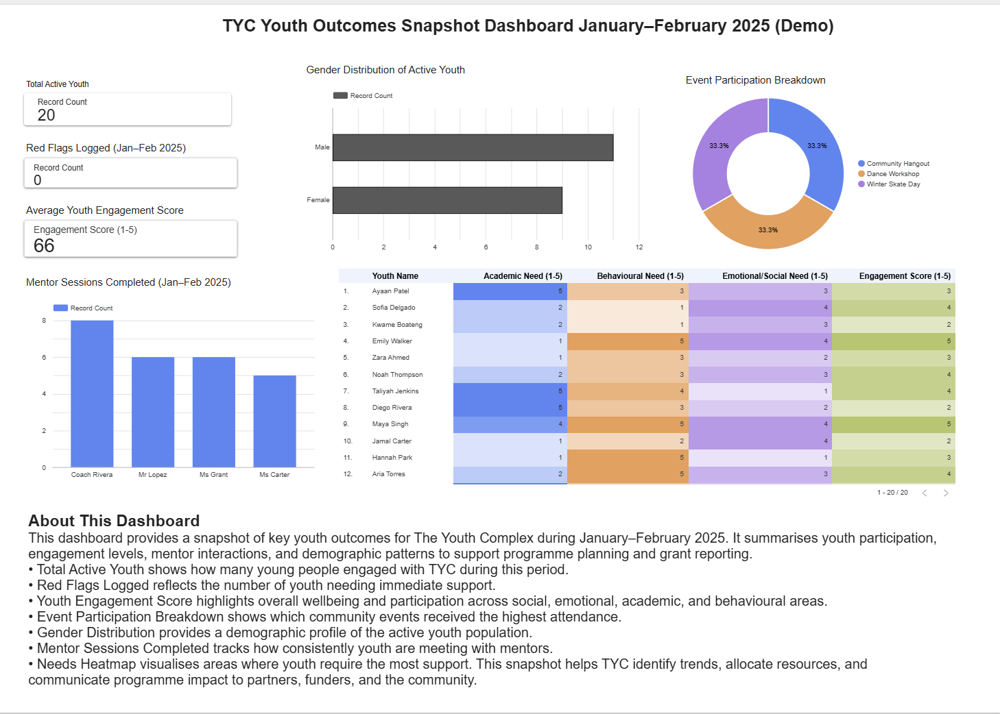

<h1 align="center">📊 TYC Youth Outcomes Snapshot Dashboard  
January–February 2025 (Demo)</h1>

  <em>A data-driven snapshot of youth wellbeing, engagement, mentor interactions, and programme impact — built for The Youth Complex.</em>

---

## 🌟 Dashboard Preview

  

---

## 🎯 Project Purpose

This dashboard was created to give The Youth Complex (TYC) a fast, visual understanding of:

- How many young people are actively engaged  
- Which events resonate most  
- Areas where youth need support  
- Mentor involvement and session consistency  
- Demographic patterns useful for programming & grant reporting  

It is designed as a **quick-decision tool** for:  
✔ programme planning  
✔ grant applications  
✔ progress reporting  
✔ leadership conversations  
✔ spotting youth at risk  

---

## 🧰 Tools & Technologies

| Tool | Use |
|------|-----|
| **Google Looker Studio** | Dashboard design, visualisation, reporting |
| **Google Sheets** | Data cleaning, validation, transformation |
| **Custom colour palette** | Youth-friendly, accessible visual theming |
| **Calculated fields** | Engagement scoring, filtering logic |

---

## 📈 Key Features and Insights

### 1. **Total Active Youth**
Shows how many young people were engaged with TYC during the reporting period.

### 2. **Gender Distribution**
Provides a demographic snapshot of the active youth population.

### 3. **Event Participation Breakdown**
Highlights which community events created the strongest engagement.

### 4. **Youth Engagement Score (1–5)**
A composite score across social, emotional, academic, and behavioural indicators.

### 5. **Mentor Sessions Completed**
Tracks mentor consistency and youth interactions across the period.

### 6. **Needs Heatmap**
Visualises which youth require support in multiple domains:
- Academic  
- Behavioural  
- Emotional/Social  
- Engagement  

This is especially useful for outreach prioritisation and allocating resources.

---

## 🧩 Why This Dashboard Matters

This snapshot helps TYC:

- Identify emerging trends in youth wellbeing  
- Understand which programmes have the strongest impact  
- Allocate mentor and staff resources efficiently  
- Support grant reporting with clean, visual evidence  
- Communicate outcomes to partners and funders  

It makes the story of the youth — and the impact of the organisation — easier to understand at a glance.

---

## 🔗 Live Dashboard Link

👉 **View the interactive Looker Studio dashboard:**  
https://lookerstudio.google.com/s/syFHAKK8oi0

---

## 👩‍💻 About the Creator

**Vidhi Sharma**  
Graduate Student, Applied Business Analytics  
Dashboard designer | Data analyst | Youth-impact storytelling through data  

Portfolio: https://17vidhisharma.github.io/portfolio-vidhi/  
LinkedIn: https://www.linkedin.com/in/17vidhisharma  

---

  Built with ❤️ for The Youth Complex.

